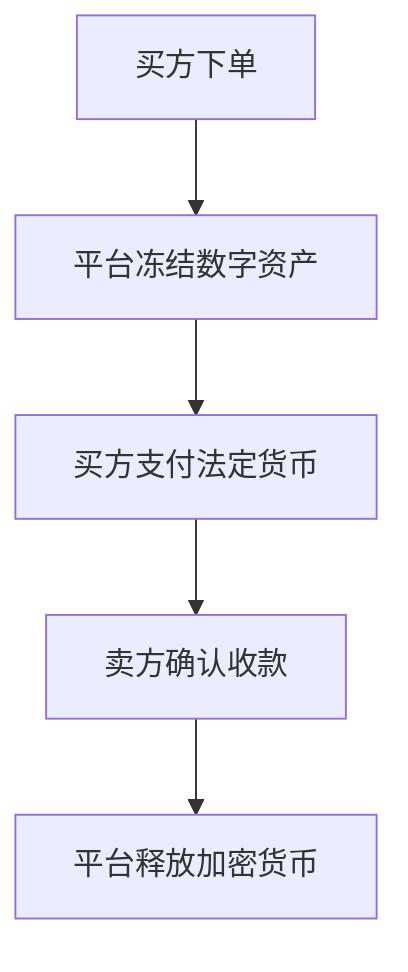

# 比特币购买全攻略：三种主流方式详解

在台湾地区，加密货币投资已逐渐成为大众理财的重要选项。本文将系统解析三大主流比特币购买方式，涵盖操作流程、优缺点对比及实用技巧，助您快速入门数字资产投资领域。

## 一、加密货币兑换所详解

### 核心操作模式
兑换所（Crypto Exchange）采用固定汇率制，运作模式类似传统银行外汇柜台。用户可直接按照平台显示的实时汇率进行台币与加密货币的双向兑换。目前台湾持牌运营的主要有MaiCoin与BitoEX两大平台。

### 支持币种对比
| 平台名称 | 支持币种                     |
|----------|------------------------------|
| MaiCoin  | 比特币(BTC)、以太币(ETH)、莱特币(LTC) |
| BitoEX   | 比特币(BTC)、以太币(ETH)             |

### 交易流程详解
**买入操作步骤：**
1. 登录平台账户
2. 选择目标币种及数量
3. 系统自动计算所需台币金额
4. 通过网络银行/ATM/超商支付
5. 10-30分钟内到账

**卖出操作要点：**
- 需完成KYC身份认证
- 绑定银行账户（建议使用与支付账户同名账户）
- 提现审核周期1-3个工作日

### 优势与局限
**优势：**
- 即时成交无延迟
- 操作界面直观易用
- 适合新手快速上手

**局限：**
- 买卖价差约1.5%-3%
- 支持币种较为有限

👉 [加密货币交易所对比指南](https://bit.ly/okx_welcome)

## 二、专业加密货币交易所解析

### 运作机制
专业交易所采用订单撮合系统，用户需自行挂单交易。平台提供深度行情数据，支持限价单、市价单等多样化交易指令。台湾市场主流平台包括Binance、OKX等国际站，以及本土合规平台。

### 法币交易流程
**充值阶段：**
- 支持渠道：银行转账、信用卡、电子支付
- 处理时效：即时到账（部分银行需1工作日）

**交易阶段：**
1. 选择交易对（如BTC/TWD）
2. 设置挂单价格与数量
3. 等待系统撮合成交
4. 查看资产变动记录

### 币币交易特色
对于持有其他加密货币的用户，可通过币币交易区直接兑换BTC。常见交易对包括ETH/BTC、USDT/BTC等，交易手续费约0.1%-0.5%。

### 风险控制要点
- 开启双重验证（2FA）
- 启用IP白名单功能
- 定期检查登录记录

👉 [数字货币投资风险防范指南](https://bit.ly/okx_welcome)

## 三、OTC场外交易市场运作

### 交易模式解析
OTC市场分为两大交易场景：
1. **点对点（P2P）交易**：买卖双方直接协商价格，通过第三方担保平台完成交易
2. **平台化交易**：在专业OTC平台发布广告，系统自动匹配交易对手

### 典型交易流程

### 价格形成机制
OTC市场报价通常采用「交易所价格±浮动溢价」模式。溢价幅度受以下因素影响：
- 交易金额（大额交易溢价更低）
- 支付方式（信用卡溢价高于银行转账）
- 市场流动性（极端行情溢价显著上升）

### 风险防范策略
- 优先选择平台担保交易
- 核实交易对手历史评价
- 单笔交易限额控制
- 避免使用第三方支付工具中转

## 四、常见问题解答（FAQ）

**Q1：新手该如何选择购买方式？**
A：首次投资建议选择兑换所，操作便捷且风险可控；熟悉市场后可转向交易所获取更多币种选择；大额交易可考虑OTC市场获取更好价格。

**Q2：哪种方式手续费最低？**
A：兑换所综合成本约1.5%-3%（含价差+手续费），交易所挂单交易约0.1%-0.5%，OTC市场大额交易可协商至0.5%以下。

**Q3：如何保障资金安全？**
A：优先选择合规平台、启用安全验证、分散存储资产、定期更换密码、警惕钓鱼网站。

**Q4：交易记录需要报税吗？**
A：根据台湾税法规定，加密货币交易所得需纳入综合所得税申报，建议保留完整交易凭证。

**Q5：如何追踪市场行情？**
A：推荐使用CoinMarketCap、CoinGecko等专业数据平台，同时可关注OKX等交易所的行情分析报告。

👉 [全球加密货币市场实时数据](https://bit.ly/okx_welcome)

## 五、投资策略建议

### 资产配置原则
- 初期配置比例建议不超过金融资产的5%
- 采用定投策略平滑市场波动
- 保持法币与数字资产动态平衡

### 风险管理技巧
- 设置自动止盈止损
- 开启价格预警通知
- 定期评估持仓结构

### 信息获取渠道
- 行业白皮书研读
- 项目方官方公告
- 权威媒体深度报道

随着区块链技术的持续发展，加密货币投资工具日趋丰富。建议投资者持续学习专业知识，在充分认知风险的前提下理性参与市场。数字资产配置应作为多元化投资组合的组成部分，通过科学的资产配置实现财富稳健增值。

*本文所述信息仅供参考，不构成投资建议。加密货币市场波动较大，请根据自身风险承受能力审慎决策。*