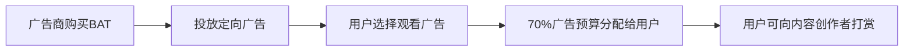

# Basic Attention Token (BAT)价格、图表、市值及相关指标

## 什么是Basic Attention Token（BAT）？
Basic Attention Token（BAT）是基于区块链技术的数字广告生态核心代币，通过创新性地重构广告收益分配模式，为用户、广告商和内容创作者构建三方共赢体系。其核心价值体现在：
- **用户价值**：使用Brave浏览器观看隐私保护广告即可获得BAT奖励
- **广告商优势**：精准投放+防欺诈机制提升广告ROI
- **创作者收益**：直接获得70%广告收入分成

### BAT生态运作机制

## BAT创始团队与核心技术
BAT由Mozilla基金会前首席技术官布莱恩·邦德（Brian Bond）与JavaScript创始人布兰登·艾克（Brendan Eich）联合创立。后者同时担任Brave浏览器CEO，其技术团队包含多位硅谷顶尖区块链专家。

### 独特创新点解析
1. **零知识证明技术**：确保广告投放过程中的隐私保护
2. **机器学习算法**：通过用户行为分析实现精准广告匹配
3. **去中心化架构**：省去传统广告中间环节，降低30%以上成本

## BAT市场核心数据
| 指标 | 数据 | 更新时间 |
|------|------|---------|
| 当前价格 | $0.42 | 2025-04-05 |
| 市值排名 | 第89位 | CoinMarketCap |
| 流通量 | 1,585,742,316 BAT | 2025 Q1 |
| 最大供应量 | 1,585,762,796 BAT | 2025年达峰 |

👉 [查看实时价格波动数据](https://bit.ly/okx_welcome)

## 生态发展里程碑
- **2017年**：完成3500万美元闪电级ICO融资
- **2019年**：Brave浏览器月活突破800万
- **2021年**：北美市场广告投放量增长300%
- **2023年**：推出BAT 2.0升级版智能合约系统
- **2025年**：全球用户突破5000万大关

## 安全保障体系
BAT采用多层防护机制：
1. **以太坊区块链**：基于ERC-20标准确保交易可追溯
2. **双因素认证**：钱包交易需通过生物识别验证
3. **冷存储系统**：98%储备金离线存储于多重签名钱包
4. **实时监控**：AI系统每秒扫描超10万笔交易

👉 [了解数字资产存储安全指南](https://bit.ly/okx_welcome)

### 常见问题解答（FAQ）

**Q：BAT总量是否会持续增加？**
A：不会。根据最新协议，BAT总量将在2025年达到15.85亿枚后停止增发，这种通缩模型有助于长期价值积累。

**Q：如何通过BAT生态盈利？**
A：三种主要方式：
1. 用户观看广告获取BAT（日均收益约0.5-2美元）
2. 内容创作者获得打赏分成
3. 持币参与流动性挖矿（年化收益约6-12%）

**Q：BAT价格受哪些因素影响？**
A：核心变量包括：
- Brave浏览器月活用户数
- 广告商预算投入规模
- 加密货币市场整体波动
- 隐私计算技术发展进程

## 投资者关注指标
建议跟踪以下关键数据：
- **用户增长曲线**：Brave每月公布的独立用户数
- **广告营收报告**：季度生态收入透明度报告
- **机构持仓变化**：CoinMetrics显示当前机构持有量占比12%
- **技术升级路线图**：2025年Q2即将推出的ZK-Rollups升级

👉 [获取专业投资分析报告](https://bit.ly/okx_welcome)

## 未来发展趋势
行业分析师预测BAT将在2025年实现三大突破：
1. **DeFi融合**：推出广告收益证券化产品
2. **元宇宙接入**：VR/AR场景广告协议开发
3. **合规化推进**：与全球5大监管沙盒建立合作

该创新生态正在重塑数字广告市场格局，其区块链解决方案已使广告欺诈率下降至行业最低的0.3%。随着Web3.0普及，BAT有望成为注意力经济领域的核心基础设施。