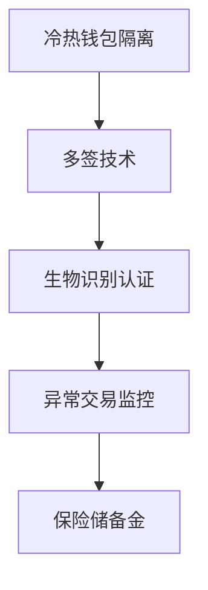
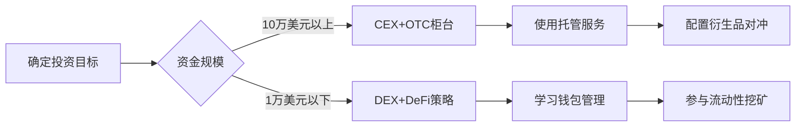

# CEX与DEX：加密货币交易所的核心差异解析

## 什么是CEX与DEX？
加密货币交易市场存在两大核心形态：中心化交易所（CEX）与去中心化交易所（DEX）。理解这两者的本质差异，对投资者选择交易方式至关重要。

**核心差异矩阵：**
| 维度          | CEX（中心化交易所）          | DEX（去中心化交易所）        |
|---------------|-----------------------------|-----------------------------|
| 运营机制      | 中心化服务器匹配订单         | 区块链智能合约自动执行       |
| 资产控制权    | 交易所托管用户资产           | 用户完全掌控私钥           |
| 交易门槛      | 需KYC认证                   | 无需注册直接使用钱包       |
| 流动性来源    | 订单簿撮合系统               | 流动性池自动做市商（AMM）  |
| 安全保障      | 平台责任担保                 | 用户自担风险                |

👉 [立即体验全球领先的加密货币交易所](https://bit.ly/okx_welcome)

### 常见问题解答
**Q：DEX是否完全匿名？**  
A：虽然无需身份验证，但区块链交易具有可追溯性，完全匿名需配合隐私币使用。

**Q：CEX资金被盗怎么办？**  
A：选择具备保险储备金机制的平台，如OKX设有10亿美元数字资产保护基金。

**Q：新手该选择哪种交易所？**  
A：建议先在CEX完成基础交易，熟悉后再尝试DEX参与DeFi生态。

---

## CEX的核心优势解析
### 1. 交易体验革命
现代CEX已构建完整生态体系：
- **智能交易系统**：集成TradingView图表分析、算法交易接口
- **多元化产品线**：现货/期货/期权/质押/借贷等一站式服务
- **法币通道**：支持银行卡、信用卡等多种入金方式
- **跨平台互通**：APP/网页/Web3钱包无缝切换

### 2. 安全防护体系
头部交易所构建五重防护机制：

### 3. 用户支持系统
- 7×24小时多语言客服
- 智能工单追踪系统
- 数字资产保险理赔通道
- 教育中心提供入门课程

👉 [探索数字资产安全保障方案](https://bit.ly/okx_welcome)

---

## DEX的创新价值
### 1. DeFi基础设施
DEX作为去中心化金融（DeFi）的核心枢纽，支撑着：
- 流动性挖矿
- 跨链桥接
- 去中心化借贷
- 合成资产创建

### 2. 创新项目孵化器
DEX具有独特优势：
- 零准入门槛上币机制
- 24小时市场流动性
- 社区治理决策权
- 透明化交易数据

### 3. 技术突破方向
DEX持续演进的关键领域：
| 技术方向       | 当前进展                 | 未来展望               |
|----------------|--------------------------|------------------------|
| 零知识证明     | StarkSwap采用ZK-Rollups  | 实现百万TPS交易性能    |
| 跨链聚合       | 1inch集成13条主链        | 构建全链DEX网络        |
| 动态做市商模型 | Curve改进稳定币兑换算法  | 开发自适应流动性协议   |

---

## 风险对比分析
### CEX潜在风险
- 黑客攻击（2022年统计损失达40亿美元）
- 平台跑路风险（如FTX事件）
- 政策监管不确定性

### DEX使用陷阱
- 滑点风险（小市值代币可达10%）
- 无谓损失（流动性提供者收益波动）
- 智能合约漏洞（2023年DeFi攻击损失超15亿美元）

👉 [获取实时市场风险预警系统](https://bit.ly/okx_welcome)

---

## 使用场景决策指南
### 选择CEX的五大理由：
1. 法币出入金需求
2. 高频交易需求
3. 金融衍生品需求
4. 新手学习阶段
5. 资产托管需求

### 选择DEX的五大场景：
1. 参与IDO首发项目
2. 构建跨链资产组合
3. 享受DeFi收益
4. 保护交易隐私
5. 支持去中心化治理

---

## 未来发展趋势
### 行业融合趋势
| 指标               | 2022年       | 2023年预测    |
|--------------------|--------------|---------------|
| CEX交易量占比      | 85%          | 78%           |
| DEX用户增长率      | 67%          | 89%           |
| 跨链DEX交易量      | $20亿        | $75亿         |
| 零知识证明DEX数量  | 3个          | 15+个         |

### 技术演进路线
1. Layer2扩容方案普及
2. 机构级做市商接入
3. 原生稳定币协议整合
4. 社交化交易界面升级

---

## 操作安全指南
### CEX使用守则
- 启用双重认证（2FA）
- 定期更换密码
- 设置提币地址白名单
- 分散存储大额资产

### DEX操作规范
- 核对合约地址真实性
- 设置合理滑点容忍度
- 保留完整交易记录
- 使用硬件钱包存储

---

## 投资者决策框架

👉 [获取专业投资策略分析报告](https://bit.ly/okx_welcome)

---

## 问答环节
**Q：如何判断项目是否值得在DEX投资？**  
A：三步评估法：检查合约审计报告、分析流动性分布、追踪开发者活动。

**Q：CEX账户被冻结怎么办？**  
A：立即联系客服提供身份证明，同时检查账户是否触发风控规则。

**Q：DEX交易确认时间多久？**  
A：受网络拥堵影响，以太坊平均6-15秒，Layer2可缩短至3秒内。

**Q：如何选择DEX聚合器？**  
A：重点关注：路由优化算法、费率透明度、支持链的数量与质量。

**Q：CEX的提现限制如何突破？**  
A：通过升级VIP等级、使用P2P交易、选择OTC柜台等合规渠道。

**Q：DEX的Gas费太高怎么办？**  
A：选择低Gas网络（如Polygon）、使用Batch交易功能、在非高峰时段操作。