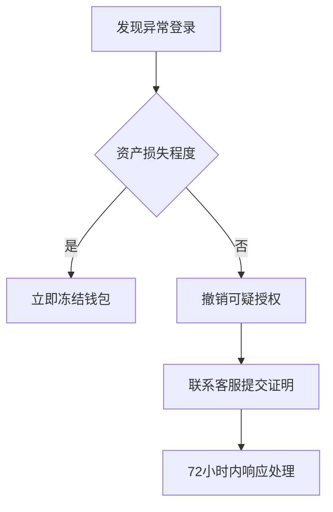

```markdown
# Nodecoin空投参与指南：手把手教你领取区块链奖励

## 一、了解Nodecoin空投的核心价值
Nodecoin作为新兴区块链生态的重要组成部分，其空投活动旨在通过激励早期用户加速网络去中心化进程。本次空投将释放总量5%的代币，参与者可通过完成基础任务获取数字资产，同时为区块链项目贡献节点资源。

### 关键数据解析
| 指标                | 数据                     |
|---------------------|--------------------------|
| 空投总量            | 500,000 NODE             |
| 单地址最高奖励      | 2,000 NODE               |
| 任务完成周期        | 2025年4月1日-4月30日     |
| 奖励发放时间        | 2025年5月15日            |

👉 [深入解析区块链空投经济模型](https://bit.ly/okx_welcome)

## 二、参与前的三大准备工作

### 1. 创建合规加密钱包
- 推荐使用MetaMask或Trust Wallet等非托管钱包
- 备份助记词时需采用物理隔离存储
- 完成钱包地址的区块链浏览器验证

### 2. 获取基础Gas费用
- 需持有0.05 ETH或等值BNB作为网络手续费
- 建议通过OKX等平台直接购买主流币种
- 避免在空投期间进行大额链上转账

### 3. 订阅官方通信渠道
- Telegram群组：@NodecoinOfficial
- Discord服务器：nodecoin.io/discord
- 推特账号：@NodecoinProject

👉 [如何选择安全的加密货币钱包？](https://bit.ly/okx_welcome)

## 三、四步完成空投任务

### 第1步：完成KYC认证
```markdown
1. 访问Nodecoin官网airdrop.nodecoin.io
2. 连接已验证的钱包地址
3. 上传身份证明文件（护照/驾照）
4. 等待1-3个工作日审核
```

### 第2步：质押基础代币
- 最低质押门槛：100 NODE（测试网代币）
- 质押周期：锁定90天可获额外20%奖励
- 质押教程视频：[操作指南链接]

### 第3步：邀请生态用户
| 邀请层级 | 奖励比例 | 最大叠加奖励 |
|----------|----------|--------------|
| 直接邀请 | 5%       | 100 NODE     |
| 二级推荐 | 2%       | 50 NODE      |

### 第4步：参与社区治理
- 每周完成DAO投票可获10 NODE奖励
- 提交有效提案通过率超60%可获50 NODE
- 社区活跃度积分每周排行榜前100名奖励

## 四、常见问题解答（FAQ）

### Q1：空投奖励是否有锁定期？
A：首批发放的50%奖励需锁定6个月，剩余部分按季度线性解锁。锁仓用户可参与质押收益池分红。

### Q2：多个钱包地址是否有效？
A：每个实名认证主体仅允许绑定一个有效地址。系统将检测异常地址关联行为，恶意刷量将导致奖励取消。

### Q3：如何查看任务进度？
A：登录空投页面后，个人仪表盘将实时更新：
- KYC状态（绿色/灰色）
- 质押倒计时
- 邀请人数统计
- 治理参与度百分比

## 五、安全注意事项

### 风险防范指南
1. 官方不会索取钱包私钥
2. 警惕仿冒邮件中的钓鱼链接
3. 使用硬件钱包存储大额资产
4. 定期检查钱包授权权限

### 异常处理流程


👉 [区块链安全最佳实践手册](https://bit.ly/okx_welcome)

## 六、空投后的价值管理策略

### 代币质押规划建议
| 质押方案      | 年化收益 | 流动性保障 |
|---------------|----------|------------|
| 基础质押      | 8.5%     | 不可提取   |
| 流动性质押池  | 6.2%     | 可随时赎回 |
| NFT绑定质押   | 12%      | 锁定NFT    |

### 税务合规提醒
- 按各国数字资产税收政策申报
- 保留空投价值的美元计价记录
- 使用区块链税务管理工具如Koinly

本指南持续更新最新空投动态，请定期访问Nodecoin官方渠道获取权威信息。参与即表示同意遵守《Nodecoin网络使用协议》相关条款。
```