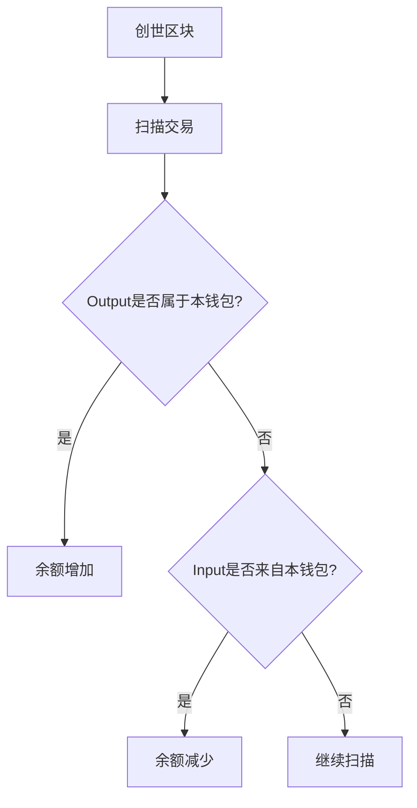

# UTXO模型：比特币交易的核心机制解析

## 重要提示
本教程为区块链技术解析内容，仅作为技术学习参考，不构成任何数字货币投资建议。

## 比特币交易的链式结构

比特币区块链由连续区块构成，每个区块包含多个交易。这些交易通过输入（Input）和输出（Output）形成追溯链条：

```
┌─────────────┐ ┌─────────────┐ ┌─────────────┐ ┌─────────────┐
│Block #1 │ │Block #2 │ │Block #3 │ │Block #4 │
│┌──┬────┬───┐│ │┌──┬────┬───┐│ │┌──┬────┬───┐│ │┌──┬────┬───┐│
││CB│50.0│OUT├┼──┐ ││CB│50.0│OUT├┼──┐ ││CB│50.0│OUT├┼──┐ ││CB│50.0│OUT││
│└──┴────┴───┘│ │ │└──┴────┴───┘│ │ │└──┴────┴───┘│ │ │└──┴────┴───┘│
│ │ │ │┌──┬────┬───┐│ │ │┌──┬────┬───┐│ │ │┌──┬────┬───┐│
│ │ │ ││ │8.70│OUT├┼──┼──▶│IN│ │ ││ └──▶│IN│25.0│OUT││
│ │ └──▶│IN├────┼───┤│ │ │├──┤58.7│OUT││ │├──┼────┼───┤│
│ │ ││ │41.3│OUT├┼─┐└──▶│IN│ │ ││ ┌──▶│IN│66.3│OUT││
│ │ │└──┴────┴───┘│ │ │└──┴────┴───┘│ │ │└──┴────┴───┘│
└─────────────┘ └─────────────┘ │ └─────────────┘ │ └─────────────┘
 └────────────────────┘
```

👉 [深入了解区块链技术原理](https://bit.ly/okx_welcome)

### UTXO的核心概念
未花费交易输出（Unspent TX Output）是比特币交易体系的基石。其核心特征包括：
1. **不可分割性**：每个UTXO必须被完整花费
2. **唯一性标识**：通过交易哈希+输出索引唯一确定
3. **价值流转性**：新交易必须消耗旧UTXO并生成新UTXO

## 钱包系统的运作机制

### 私钥管理体系
钱包程序本质是私钥管理器，其运作流程包括：
1. 私钥生成：通过加密算法创建256位随机数
2. 公钥推导：使用椭圆曲线加密技术生成公钥
3. 地址编码：对公钥进行哈希运算和Base58编码

### 余额计算逻辑
钱包余额计算需要遍历区块链数据：


## 区块链数据索引优化

### 实时查询挑战
直接扫描区块链查询余额面临：
- 数据量庞大（数百GB）
- 查询效率低下
- 资源消耗过高

### 索引构建方案
通过构建地址-余额映射表实现高效查询：
| address | balance | lastUpdatedAtBlock |
|---------|---------|-------------------|
| 1A1zP1e... | 50.0 | 0 |
| 1HLoD9T... | 40.0 | 3 |
| 1HB5XML... | 50.0 | 3 |
| 1FvzL7Q... | 10.0 | 3 |

👉 [探索区块链技术应用](https://bit.ly/okx_welcome)

## 技术对比分析

| 特性维度 | UTXO模型 | 账户模型 |
|---------|----------|----------|
| 数据结构 | 交易图谱 | 状态数据库 |
| 并行处理 | 高效 | 困难 |
| 隐私保护 | 强 | 一般 |
| 合约支持 | 有限 | 完善 |
| 扩展性 | 优秀 | 一般 |

## 技术演进路径

区块链数据库的发展呈现出双重特性：
1. **不可变日志**：区块链作为原始交易日志
2. **状态快照**：本地数据库保存实时状态

这种架构优势体现在：
- 数据完整性保障
- 高效查询能力
- 多节点一致性验证

### 小结
比特币的UTXO模型通过独特的交易结构设计，在保证安全性的同时实现了高效的价值转移。现代钱包系统通过构建索引数据库，在保持区块链不可篡改特性的同时，显著提升了用户体验。

👉 [获取区块链技术资源](https://bit.ly/okx_welcome)

## 常见问题解答

**Q：UTXO模型与银行账户系统有何本质区别？**
A：UTXO采用交易驱动的记账方式，每个交易都包含完整的价值转移路径；而银行账户是状态驱动的余额系统，仅记录当前账户状态。

**Q：为什么新钱包需要同步区块链数据？**
A：钱包需要完整扫描区块链来构建UTXO集合，这个过程相当于从创世区块开始逐笔核对所有交易记录。

**Q：如何实现毫秒级余额查询？**
A：通过构建带索引的地址-余额映射表，将区块链的只读日志转化为可快速查询的状态数据库。

**Q：UTXO模型的安全性如何保障？**
A：每个UTXO的花费都需要对应私钥签名，且所有交易都需通过网络节点验证，确保交易不可伪造。

**Q：为什么比特币选择UTXO而非账户模型？**
A：UTXO天然支持并行处理和隐私保护，更适合点对点电子现金系统的去中心化需求。

**Q：钱包同步过程中断会怎样？**
A：可能导致余额显示不准确，需重新同步区块链数据才能恢复完整交易记录。