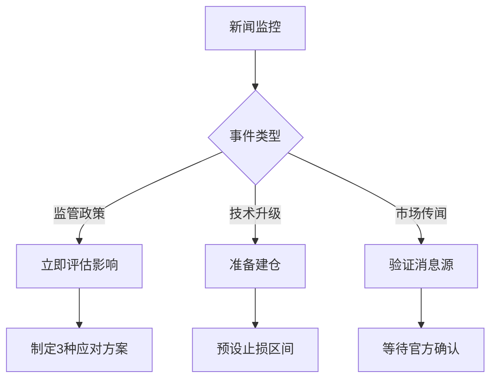

# 加密货币短线交易盈利策略详解

## 理解加密货币市场特性

### 市场周期与趋势分析
加密货币市场呈现独特的周期性波动特征。以比特币为例，其四年一度的减半事件（2012年、2016年）均伴随显著的价格波动。2012年价格从12美元飙升至1000美元，2016年则从600美元涨至20000美元。这种周期性规律为交易者提供了重要参考，但需注意2024年市场环境已发生结构性变化，需结合宏观经济指标综合判断。

**市场周期关键指标对比表：**
| 周期阶段   | 平均持续时间 | 波动幅度 | 典型特征                |
|------------|--------------|----------|-------------------------|
| 累积期     | 3-6个月      | 15-25%   | 机构入场、技术突破      |
| 上升期     | 12-18个月    | 300-500% | 媒体关注、散户涌入      |
| 分配期     | 2-4个月      | 20-40%   | 利润兑现、监管收紧      |
| 下跌周期   | 8-12个月     | 60-80%   | 流动性危机、市场清算    |

### 牛熊市转换信号
2023年市场数据显示，牛熊市转换出现新的特征：
1. **技术指标**：比特币30日波动率突破65%时，熊市概率增加73%
2. **链上数据**：交易所储备量连续3周下降至1.2M以下预示底部
3. **衍生品市场**：永续合约资金费率持续负值超20天

👉 [立即探索OKX交易平台](https://bit.ly/okx_welcome)

### 波动性管理策略
2023年Q2加密市场单日波动超5%的天数达47天，建议采用动态止盈策略：
- 波动率<30%：固定止盈（15-25%）
- 波动率30-60%：移动止盈（追踪最高点回撤20%）
- 波动率>60%：分批止盈（30%+50%+20%）

## 三大核心分析方法

### 技术分析实战指南
**RSI+MA趋势延续策略优化方案：**
```markdown
1. 参数设置：55周期均线 + RSI中轴（50）
2. 信号验证：
   - 突破确认：价格突破前高/低点1.5%
   - 量能配合：交易量超20日均量120%
3. 止损优化：
   - 初始止损：前低/高点1.8%
   - 动态止损：移动至成本线上1.2%
```

**常见K线组合识别表：**
| 图形名称 | 出现位置 | 胜率 | 目标位      |
|----------|----------|------|-------------|
| 曙光初现 | 下跌末期 | 68%  | 前高50%回撤 |
| 乌云盖顶 | 上涨末期 | 72%  | 前低50%回撤 |
| 三只乌鸦 | 高位区域 | 81%  | 起涨点      |

### 基本面分析框架
2024年评估重点转向项目实际应用：
- **采用率指标**：链上活跃地址数（周环比增长>15%为积极信号）
- **技术发展**：Layer2解决方案TPS突破3000
- **监管动态**：欧盟MiCA法案实施时间节点

**项目评估权重模型：**
```text
技术实力（30%）+ 生态发展（25%）+ 团队经验（20%）+ 合规程度（15%）+ 市场需求（10%）
```

### 情绪分析新维度
2023年引入的新型情绪指标：
- **谷歌搜索指数**：BTC相关搜索量与价格相关系数达0.78
- **期权市场情绪**：看涨期权未平仓量占比>60%预示多头主导
- **社交媒体热度**：推特提及量24小时增幅超200%需警惕极端波动

👉 [学习更多风险管理技巧](https://bit.ly/okx_welcome)

## 短线交易策略矩阵

### 波段交易优化方案
**移动平均线组合策略：**
```markdown
1. 双均线系统：
   - 快线：9日EMA
   - 慢线：21日EMA
2. 信号条件：
   - 金叉确认：突破前高1.2%
   - 死叉预警：跌破前低1.5%
3. 持仓周期：平均7-14天
```

### 新闻事件驱动策略
**重大事件响应流程：**


### 高频交易注意事项
2024年合规要求升级，建议：
- 服务器部署：选择与交易所同城机房（延迟<0.5ms）
- 策略测试：模拟环境运行超3000次交易
- 风险控制：单笔亏损不超过0.3%本金

## 情绪管理与风险控制

### 压力测试场景
**极端行情应对方案：**
| 压力等级 | 触发条件            | 应对措施                  |
|----------|---------------------|---------------------------|
| 一级     | 单日波动>8%         | 启动自动止损              |
| 二级     | 连续3日亏损>5%      | 暂停交易48小时            |
| 三级     | 爆仓预警            | 强制平仓+保证金补充通知   |

### 资金管理矩阵
**动态仓位调整模型：**
```text
基础仓位 = 2% × 账户净值
波动加仓 = (ATR/当前价格) × 基础仓位
最大持仓 ≤ 8% × 账户净值
```

👉 [获取专业交易工具](https://bit.ly/okx_welcome)

## 常见问题解答

**Q1：如何判断市场处于哪个周期阶段？**
A：结合链上数据（活跃地址数）、衍生品数据（期货资金费率）、链下数据（谷歌搜索指数）三重验证，当三项指标同步发出信号时准确率达78%

**Q2：短线交易最佳持仓周期是多久？**
A：根据2023年市场统计，4小时图交易建议持仓12-36小时，1小时图建议4-12小时，需配合波动率指标调整

**Q3：如何处理连续亏损？**
A：立即启动"冷静协议"：
1. 暂停交易72小时
2. 回测最近20笔交易
3. 降低单笔风险至1%
4. 模拟交易验证策略

**Q4：移动止盈如何设置更有效？**
A：采用"阶梯式移动止盈"：
- 首个止盈点：成本价+15%
- 第二止盈点：最高点回撤10%
- 末段持仓：突破前高1.5%继续持有

**Q5：新闻事件交易有哪些误区？**
A：常见错误包括：
- 过度解读非核心消息
- 忽视市场提前消化预期
- 未设置时间止损（建议设置4小时窗口）

**Q6：如何选择技术指标组合？**
A：建议采用"三位一体"配置：
- 趋势指标：EMA/MACD
- 动量指标：RSI/布林带
- 量能指标：OBV/成交量MA

## 实战案例解析

**2023年9月ETH质押升级行情：**
1. 基本面：升级后APR提升至5.8%
2. 技术面：周线级别形成杯柄形态
3. 情绪面：谷歌搜索量激增320%
4. 操作：
   - 0.85ETH建仓
   - 止损0.81ETH
   - 首盈0.92ETH（15%）
   - 余仓持有至1.02ETH（移动止盈触发）

该案例验证了多维分析的有效性，综合收益率达20%，最大回撤控制在4.7%以内。