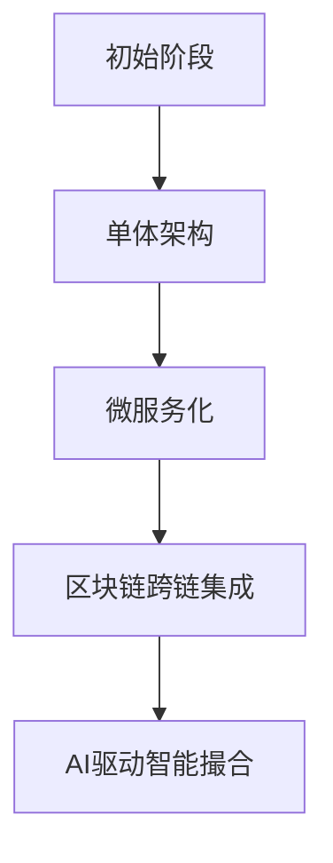

# 如何打造类似币安的加密货币交易所：从0到1完整指南

## 为什么选择创建加密货币交易所？

在数字经济浪潮中，加密货币交易市场正以年均67.3%的复合增长率扩张。作为全球领先的数字资产交易平台，币安日均处理交易量超760亿美元，覆盖180多个国家的1.28亿用户，其成功源于三大核心优势：

- **技术架构**：每秒处理140万笔交易的高性能引擎
- **合规体系**：建立SAFU安全基金保障用户资产
- **生态布局**：涵盖现货、衍生品、质押等全场景服务

对于初创企业而言，这不仅是商业机遇，更是构建新型金融基础设施的机会。通过差异化定位，新入场者完全可以在细分市场建立竞争优势。

👉 [洞察全球领先交易平台运营模式](https://bit.ly/okx_welcome)

## 核心功能矩阵

### 管理端核心模块
| 功能模块         | 技术实现要点                  |
|------------------|-----------------------------|
| KYC/AML系统      | 多因子生物识别+AI风控引擎     |
| 订单簿管理       | 分布式内存数据库+实时撮合     |
| 安全防护体系     | 多签钱包+冷热分离+量子加密    |
| 数据分析仪表盘   | 实时交易热力图+用户行为分析   |

### 用户端核心体验
```markdown
1. 三端一体化：Web/Mobile/PWA全平台覆盖
2. 多语言支持：覆盖20+主流语言市场
3. 智能交易工具：集成网格交易、条件单等专业功能
4. 社交化功能：交易信号共享与跟单系统
```

## 开发路径对比分析

### 自主开发方案
- **优势**：
  - 完全定制化技术架构
  - 掌握核心知识产权
  - 可扩展性达企业级标准
- **挑战**：
  - 开发周期12-18个月
  - 初期投入超$500万
  - 需组建30+人技术团队

### 克隆脚本方案
- **优势**：
  - 30天内完成部署
  - 成本降低至$50万以内
  - 预置合规模块
- **局限**：
  - 定制化程度受限
  - 技术迭代依赖供应商

👉 [获取行业头部解决方案白皮书](https://bit.ly/okx_welcome)

## 运营合规框架

全球主要司法管辖区监管要求对比表：

| 区域       | 牌照类型         | 资本金要求    | 审核周期   |
|------------|------------------|---------------|------------|
| 欧盟       | MiCA合规框架     | €120万        | 6-8个月    |
| 美国       | MSB牌照+州牌照   | $500万        | 9-12个月   |
| 新加坡     | MAS数字支付牌照  | S$50万        | 4-6个月    |
| 阿联酋     | VARA虚拟资产牌照 | AED 200万     | 3-5个月    |

## 收益模式创新

现代交易所盈利矩阵：
1. **交易手续费**：0.02%-0.1%阶梯费率体系
2. **流动性挖矿**：年化收益可达8-15%
3. **资产托管**：机构级冷存储服务
4. **数据服务**：提供API市场数据接口
5. **品牌合作**：联合发行平台币

👉 [探索多元化盈利模式](https://bit.ly/okx_welcome)

## FAQ：常见问题解答

**Q1：初创企业需要多少资金启动交易所？**
A：采用克隆脚本方案最低$50万即可启动，包含基础部署和合规认证。建议预留$200万用于初期市场推广。

**Q2：如何确保平台安全性？**
A：应建立四层防护体系：多签钱包、冷热分离、量子加密、实时风控监控，参考币安SAFU模式建立保险基金。

**Q3：全球扩张需要哪些准备？**
A：优先选择监管友好地区（如迪拜、新加坡），建立本地化运营团队，完成多语言系统部署，适配各地区支付通道。

**Q4：如何快速获取用户？**
A：采用"三步增长法"：社区运营（Discord/Telegram）+ KOL合作 + 零手续费推广期，配合空投激励计划。

**Q5：技术团队需要哪些关键人才？**
A：核心团队应包含区块链架构师、高频交易系统专家、合规法律顾问、网络安全工程师，建议引入具有FinTech经验的CTO。

## 技术架构演进路线



## 市场拓展策略

1. **地域选择**：优先布局东南亚、拉美等加密货币渗透率增长超200%的新兴市场
2. **产品组合**：推出"交易所+"生态，集成DeFi聚合器、NFT市场、元宇宙交易场景
3. **合规创新**：申请虚拟资产服务提供商(VASP)认证，布局证券型代币(STO)业务
4. **技术迭代**：2024年Q3计划集成零知识证明(ZKP)技术，提升交易隐私性

通过系统化构建合规、技术、运营三大支柱，初创企业完全可以在3年内实现百万级用户规模。关键成功要素包括：选择可扩展的技术架构、建立全球化合规体系、打造差异化产品矩阵。加密货币交易市场正在重塑全球金融基础设施，现在正是入场的最佳时机。